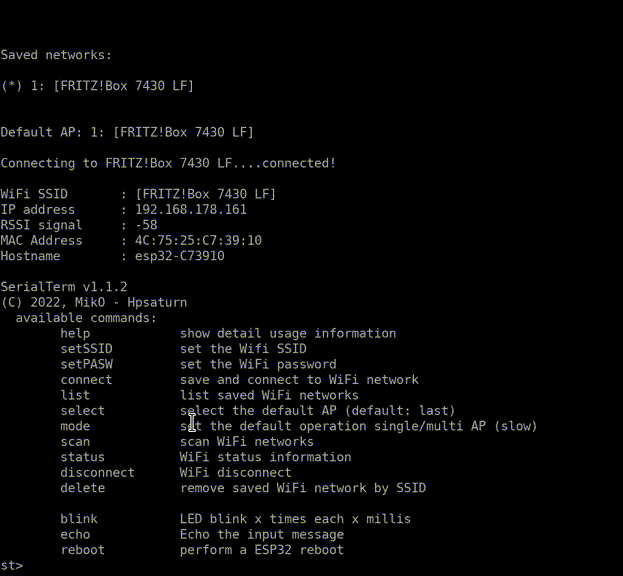

# esp32-wifi-cli

Basic and extendible Wifi CLI manager via serial command line for ESP32

## Demo

## Features

- [x] interactive serial terminal, prompt and backspace support
- [x] extendible: custom user commands and also the help menu
- [x] Wifi multi AP and single AP modes
- [x] preferences persist in flash ROM
- [x] two kind of parsers: Argument into quotes or two parameters
- [ ] debug mode off
- [ ] esp8266 support

## Arduino IDE requeriments

This ESP32 CLI is based on the old SerialTerminal of @miko007. Please use my fork that has some improvements: [SerialTerminal Library](https://github.com/hpsaturn/SerialTerminal)

## Credits

Based on [SerialTerminal](https://github.com/miko007/SerialTerminal)
